# Phase 0 — Carte de périmètre (Scope Map)

**Date**: 2026-04-14
**Moteur cible**: `planner_v2.html` v11.12.9

---

## 1. Architecture du moteur planner

```mermaid
graph TD
    A[planner_v2.html] -->|"L1489-6283"| B["/*__ENGINE_START__*/ ... /*__ENGINE_END__*/"]
    B --> C[Constantes fiscales L1490-1541]
    B --> D[calcTax L1542-1648]
    B --> E[calcCorpTax L1649-1697]
    B --> F[calcQPP / calcOAS / calcGIS L1698-1730]
    B --> G[RRIF table + getRRIFMin L1730-1747]
    B --> H[Tests intégrés L1748-4244]
    B --> I[Stress scenarios STR L4246-4320]
    B --> J[Corrélation matrices CRM/CRM8 L4277-4329]
    B --> K[Smile spending sMul L4330-4337]
    B --> L[Mortalité CPM-2023 L4341-4462]
    B --> M[Payroll deductions L4514-4539]
    B --> N[runMC L4541-6100]
    B --> O[optimizeDecum L3750-4100]
    B --> P[Estate/probate L5736-5747]

    A -->|"L6284+"| Q[React UI + handlers]
    A -->|"L1-398"| R[HTML/CSS design tokens]
    A -->|"L399-1488"| S[React components]

    A2[Web Worker L420-445] -->|"extracts"| B
```



## 2. Domaines de constantes identifiés

### 2.1 Fiscalité (estimé ~180 valeurs)
| Sous-domaine | Lignes | Nb approx. |
|-------------|--------|------------|
| Paliers fédéraux + taux | 1491-1493 | 10 |
| Paliers provinciaux (13 prov.) | 1525-1540 | ~130 |
| Surtaxe Ontario | 1622-1626 | 4 |
| Dividend gross-up fédéral | 1552-1553 | 2 |
| Dividend credits fédéraux | 1587-1588 | 2 |
| Age/pension credits fédéraux | 1561-1580 | 6 |
| Capital gains inclusion | 4499 | 3 |

### 2.2 Programmes gouvernementaux (~25 valeurs)
| Sous-domaine | Lignes | Nb approx. |
|-------------|--------|------------|
| OAS (max, seuil, 75+) | 1494-1495 | 5 |
| GIS (max single/couple, taux) | 1496-1497 | 4 |
| QPP/CPP (max, MGA, YAMPE, ajustements) | 1498-1502 | 8 |
| RRIF table (25 entrées) | 1745 | 25 |
| TFSA limite annuelle | 1503 | 1 |
| TFSA cumul historique | 4643-4648 | ~7 |
| FHSA (limites) | 3808, 3937 | 3 |

### 2.3 Corporate / CCPC (~40 valeurs)
| Sous-domaine | Lignes | Nb approx. |
|-------------|--------|------------|
| Taux corp provinciaux (13×3) | 1663-1677 | 39 |
| SBD limit, passive grind | 1657-1660 | 4 |
| RDTOH taux | 1685 | 1 |

### 2.4 Paie / Charges sociales (~12 valeurs)
| Sous-domaine | Lignes | Nb approx. |
|-------------|--------|------------|
| QPP/CPP cotisations | 4514-4528 | 6 |
| EI | 4530-4534 | 3 |
| RQAP | 4536-4539 | 3 |

### 2.5 Marchés / Hypothèses (~30 valeurs)
| Sous-domaine | Lignes | Nb approx. |
|-------------|--------|------------|
| Returns/vol par défaut | 4549-4552 | 4 |
| Multi-actifs (8 classes) | 4577-4584 | ~16 |
| Corrélation CRM standard | 4277-4291 | 25 |
| Corrélation CRM crise | 4292-4295 | 25 |
| Corrélation CRM8 | 4296-4329 | 64 |
| MER/tax drag defaults | sanitization | 4 |

### 2.6 Mortalité (~150 entrées)
| Sous-domaine | Lignes | Nb approx. |
|-------------|--------|------------|
| CPM Male qx (ages 30-100) | 4341-4398 | 71 |
| CPM Female qx (ages 30-100) | 4399-4457 | 71 |
| Improvement factor | 4461 | 1 |
| Death age cap | 4462 | 1 |

### 2.7 Stress / Scénarios (~90 valeurs)
| Sous-domaine | Lignes | Nb approx. |
|-------------|--------|------------|
| 9 scénarios × ~10 params chacun | 4246-4275 | ~90 |

### 2.8 Succession / Probate (~15 valeurs)
| Sous-domaine | Lignes | Nb approx. |
|-------------|--------|------------|
| Frais d'homologation par province | 5736-5747 | ~15 |

### 2.9 Décaissement / Comportement (~15 valeurs)
| Sous-domaine | Lignes | Nb approx. |
|-------------|--------|------------|
| Smile defaults (goP, slP, noP) | 4330-4337 | 6 |
| CFG_SMOOTH (lissage retraits) | 1505-1514 | 8 |
| GST credit (base, seuil) | 4804-4808 | 4 |

### 2.10 Defaults paramètres (~20 valeurs)
| Sous-domaine | Lignes | Nb approx. |
|-------------|--------|------------|
| Inflation default | sanitization | 1 |
| Allocation par défaut | sanitization | 3 |
| deathAge default | sanitization | 1 |
| Spending phases defaults | sanitization | 3 |
| Autres || fallbacks dans runMC | dispersé | ~12 |

**Total estimé: ~580 valeurs hardcodées métier.**

## 3. Stratégie d'extraction recommandée

### 3.1 Structure cible (3 tiers)

```
lib/constants/
├── engine-fiscal-2026.ts      # Fiscalité + gov (change chaque année)
├── engine-tables-2026.ts      # RRIF, mortalité, stress (données de référence)
├── engine-defaults.ts          # Hypothèses marché, allocations, comportement
├── engine-corporate-2026.ts   # Taux corporatifs (13 provinces × 3 taux)
├── engine-estate-2026.ts      # Probate par province
├── engine-index.ts            # getEngineConstants(year) → agrège tout
└── index.ts                   # Re-export public
```

### 3.2 Mécanisme d'injection dans le planner

Le planner est un fichier HTML monolithique avec un Web Worker qui extrait le code entre `__ENGINE_START__` et `__ENGINE_END__`. Options:

| Option | Faisabilité | Risque |
|--------|-------------|--------|
| **A. Build-time injection** — Script qui lit `engine-fiscal-2026.ts`, génère un bloc `var C = {...}` injecté en tête de `__ENGINE_START__` | Haute | Faible — pas de changement d'architecture |
| **B. Module séparé** — Extraire le JS du planner vers `lib/engine-planner.js`, l'importer dans le HTML via `<script>` | Moyenne | Moyen — casse le Web Worker pattern |
| **C. Inline avec import map** — Utiliser ES module imports dans le HTML | Basse | Élevé — compatibilité navigateur, CSP |

**Recommandation**: Option A. Un script de build (`scripts/inject-constants.ts`) lit les constantes typées et génère un `var C = { ... };` plain JS injecté dans le planner. Le moteur lit `C.FED_BRACKETS` au lieu de `FED_BRACKETS`. Le script vérifie aussi la non-régression.

### 3.3 Gestion des 3 copies

| Fichier | Action |
|---------|--------|
| `planner_v2.html` (racine) | Source de développement — reçoit les constantes injectées |
| `public/planner_v2.html` | Généré par build script (copie de la racine après injection) |
| `public/planner-expert.html` | Audit de divergence en Phase 1, puis synchroniser ou déprécier |

## 4. Prérequis techniques identifiés

1. **Test runner CLI pour le planner** — Extraire le JS entre `__ENGINE_START__` / `__ENGINE_END__`, l'exécuter dans Node.js avec les 144 tests. Indispensable pour CI/CD.
2. **Script de build injection** — Lit les constantes TypeScript, produit du JS vanilla, injecte dans le HTML.
3. **Snapshot de référence** — Capturer les outputs MC pour 5+ profils AVANT tout refactoring. Comparaison bit-à-bit après.
4. **Porter les bug fixes** de `lib/engine/index.js` vers `planner_v2.html` (dividend credits, spouse pension, Ontario surtax) AVANT la centralisation.

## 5. Hors périmètre (explicite)

- Conversion du moteur planner en TypeScript.
- Remplacement du pattern Web Worker.
- Migration de `lib/engine/index.js` vers import du planner (futur — hors ce refactor).
- Ajout de seed RNG (souhaitable mais séparé).
- Conversion du fichier monolithique en multi-fichiers (architecture séparable).
